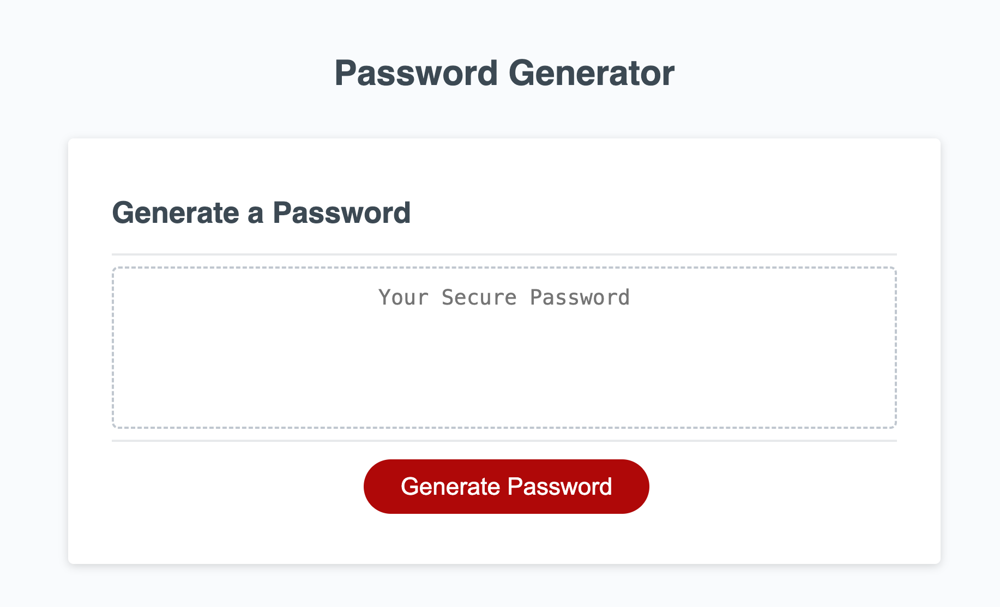

# PasswordGenerator
## Project Description
Have you ever wanted to to quickly generate strong and secure password? This project aims to solve this problem. The user enters their password requirements and the program will generate a password within seconds.

## Usage 
https://kekwulugo.github.io/PasswordGenerator/

## Installation
You can copy the files in this respository and run the program directly in the browser with a sleek and simple user interface

## Technology Used
HTML
CSS
JavaScript
## Credits
Starter Code Courtesty of Edward Apostol and the Skill Hat DTTP Web Development Program 2024

